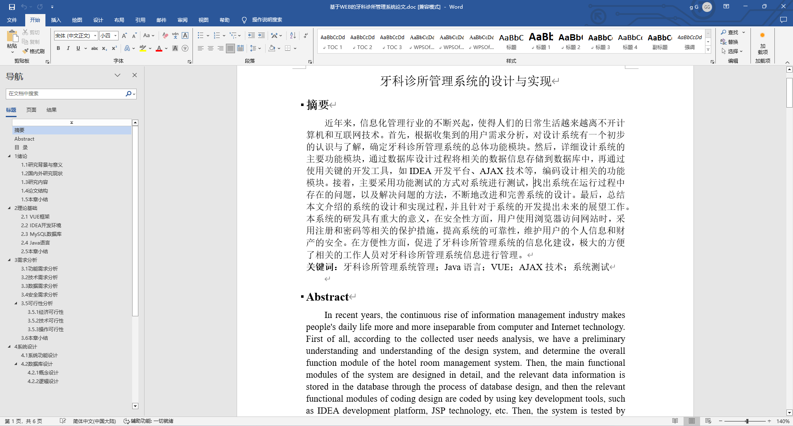
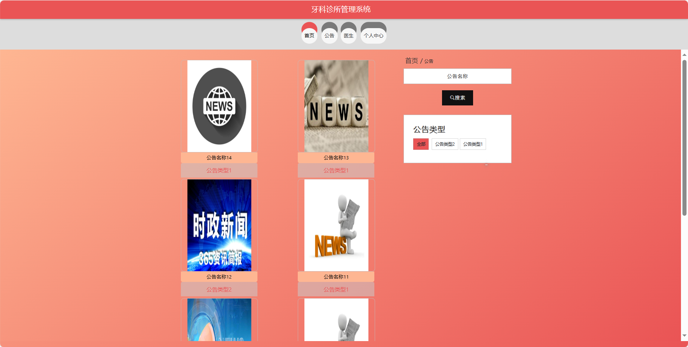
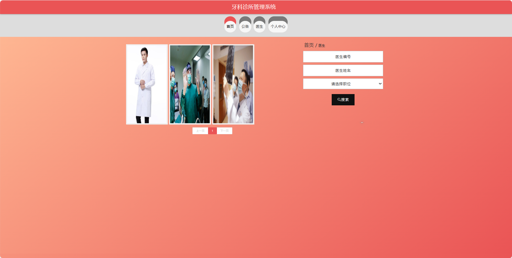
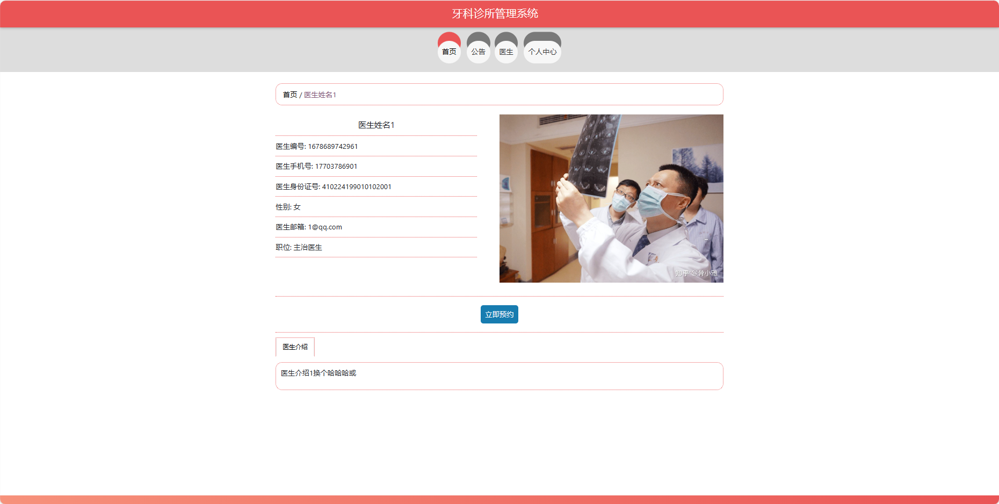
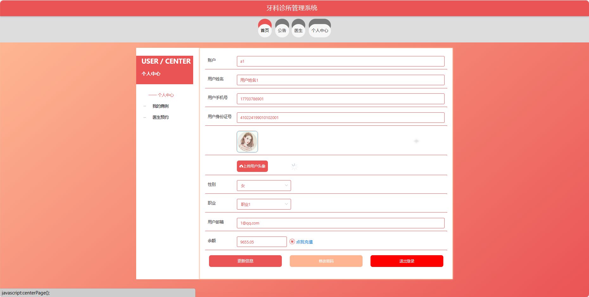
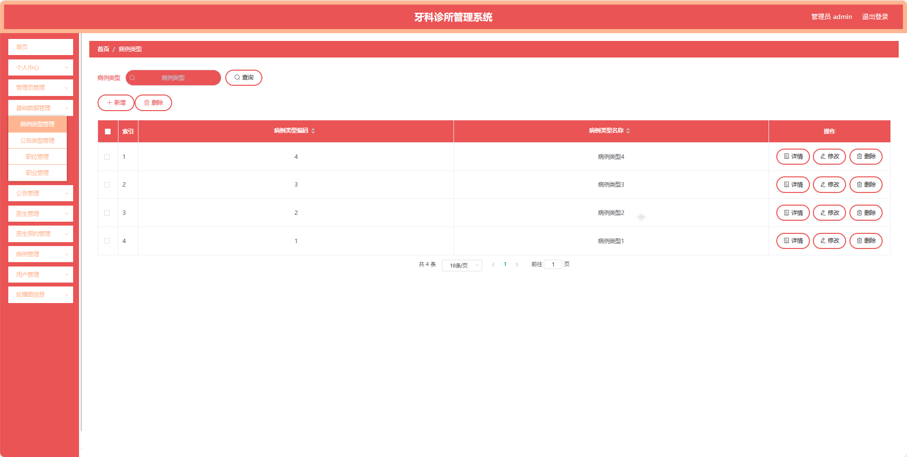
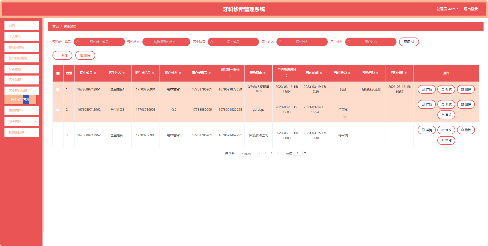
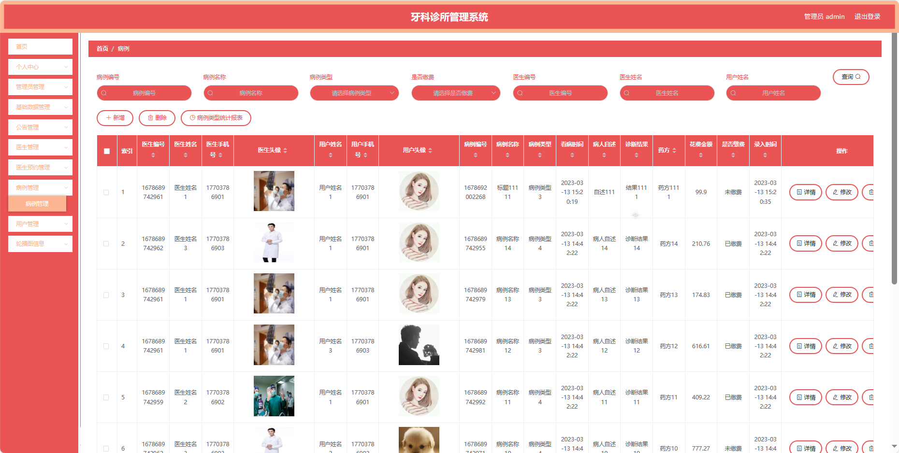

## 基于SpringBoot的牙科诊所管理系统(程序+报告)

###  获取sql数据库文件: 从戎源码网 (https://armycodes.com/) QQ: 386869957 QQ群: 377586148
###  所有系统地址: (https://github.com/YuLin-Coder/AllProjectCatalog) 
###  所有项目以及源代码本人均调试运行无问题 可支持远程安装部署调试、定制修改、代码讲解

## 项目介绍
基于SpringBoot的牙科诊所管理系统，系统包含三种角色：管理员、用户,医生主要功能如下。

### 【管理员】:
首页：查看牙科诊所管理系统整体概况和关键数据。
个人中心：修改密码、管理个人信息。
管理员管理：审核和管理注册管理员用户的信息。
基础数据管理：管理系统的基础数据，病例类型、公告类型、职位和职业信息。
公告管理：发布、编辑和删除系统的通知和公告。
医生管理：审核和管理注册医生用户的信息。
医生预约管理：处理患者的医生预约请求，包括查看、确认等。
病例管理：查看和管理患者的病例信息，包括诊断和治疗记录。
用户管理：审核和管理注册用户的信息。
轮播图信息：管理系统首页的轮播图。

### 【医生功能】
首页：查看牙科诊所管理系统的信息。
个人中心：修改密码、管理个人信息。
公告管理：查看系统发布的通知和公告。
医生预约管理：查看患者的预约请求。
病例管理：记录和管理患者的病例信息。
用户管理：查看患者信息。

### 【用户】:
首页：浏览牙科诊所管理系统的主要信息。
公告：阅读系统发布的相关通知和公告。
医生：查看牙科诊所的医生信息，包括专业背景和出诊时间。
个人中心：管理个人信息，包括预约记录和历史病例。

## 项目技术
- 编程语言：Java
- 数据库：MySQL
- 项目管理工具：Maven
- 前端技术：HTML、CSS、JavaScript、Jquery、Vue
- 后端技术：Spring、SpringMVC、MyBatis

## 运行环境
- JDK版本：JDK1.8及以上
- 开发工具：IDEA、Ecplise、Myecplise都可以
- 数据库: MySQL5.7及以上
- Maven：maven3.0及以上
- Node：14.14.0及以上

## 运行截图

